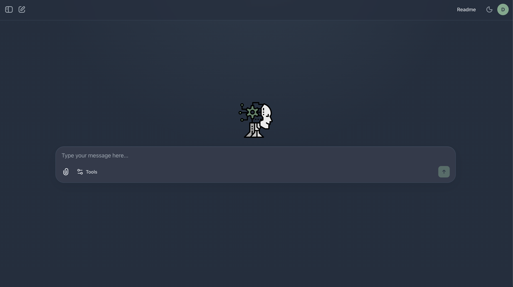

<div align="center">

# 🧠 Aria

**Your local AI assistant with a unified tool-driven architecture**

[](https://www.python.org/downloads/)
[](https://github.com/malvavisc0/aria-ai/actions/workflows/ci.yml)
[](https://pypi.org/project/aria-ai/)
[](https://github.com/malvavisc0/aria-ai/pkgs/container/aria)
[](LICENSE)
[](https://github.com/astral-sh/ruff)

*Run a local AI assistant with a web UI, CLI, and desktop GUI*

</div>

<div align="center">

</div>

---

## ✨ Features

| | Feature | Description |
|:--|:--------|:------------|
| 🎯 | **Unified Tool Architecture** | 7 categories, 33 tools managed by a centralized registry |
| 🖥️ | **Multiple Interfaces** | Web UI, CLI, and native PySide6 desktop GUI |
| 🤖 | **Local LLM Support** | Run models locally with vLLM (GPU-accelerated inference with GPTQ/AWQ quantization) |
| 🌐 | **Browser Automation** | Lightpanda headless browser with CDP/Playwright support |
| 🔒 | **Privacy First** | Your data stays on your machine |
| 🌐 | **Web Research** | Search, weather, finance, and more |
| 💻 | **Code Execution** | Safe Python sandbox and shell commands |
| 📊 | **Knowledge & Planning** | Persistent knowledge store, structured reasoning, task planning |
| 👷 | **Worker Agents** | Background workers for heavy tasks (research, code generation, analysis) |
| 📄 | **Document Conversion** | Convert office/HTML/PDF uploads to markdown on demand via `ax documents convert` (MarkItDown + optional local Granite-Docling for scanned PDFs) |
| 🔧 | **CLI Tool Commands** | Domain-specific CLI commands for search, finance, IMDb, and more |
| 🔬 | **Model Fine-Tuning** | LoRA/QLoRA fine-tuning with CLI-driven workflows |

---

## 🚀 Quick Start

### Option A — Run from source

```bash
git clone git@github.com:malvavisc0/aria-ai.git
cd aria-ai
uv sync   # pins CPU-only torch automatically (embeddings run on CPU; vLLM has its own isolated CUDA venv)
aria server run
# → Open http://localhost:9876
```

### Option B — Install from PyPI

```bash
pip install aria-ai
aria server run
# → Open http://localhost:9876
```

### Option C — Docker (GPU required)

```bash
docker run -p 9876:9876 -v ./data:/app/data ghcr.io/malvavisc0/aria-ai-cuda:latest
# → Open http://localhost:9876
```

### Option D — Desktop GUI

```bash
pip install aria-ai[gui]
aria-gui
```

Or download the standalone binary for your platform from the [latest release](https://github.com/malvavisc0/aria-ai/releases/latest):

| Platform | File |
|----------|------|
| 🐧 Linux | `Aria-x86_64.AppImage` |
| 🪟 Windows | `Aria-Windows-x86_64.zip` |
| 🍎 macOS (Apple Silicon) | `Aria-macOS-arm64.zip` |

---

## 🤖 Agent System

Aria uses a **tool-first architecture** centered around one primary agent with a centralized tool registry. Tools are organized into always-loaded core capabilities and on-demand domain tools that load when needed. Heavy tasks are delegated to background **worker agents**.

### How It Works

```
User Request → Aria → Registry-selected tools → Response
                ↓ (heavy tasks)
            Worker Agent → Background execution → Result file
```

Aria evaluates each request, keeps core capabilities available by default, and pulls in domain-specific tools only when the task requires them. Tasks requiring 5+ tool calls are automatically delegated to worker agents that run in the background.

---

## 🛠️ Tools

Tools are organized into **7 categories** (33 tools) managed by a centralized registry. Core and file tools are always available; domain tools load on demand.

| Category | Loading | Tools |
|:---------|:--------|:------|
| 🧠 **Core** | Always | reasoning, plan, knowledge, scratchpad, web_search, download, weather, shell |
| 📁 **Files** | Always | read_file, write_file, edit_file, file_info, list_files, search_files, copy_file |
| 🌍 **Browser** | On-demand | open_url, browser_click |
| 🐍 **Development** | On-demand | python |
| 📊 **Finance** | On-demand | fetch_current_stock_price, fetch_company_information, fetch_ticker_news |
| 🎬 **Entertainment** | On-demand | search_imdb_titles, get_movie_details, get_person_details, get_person_filmography, get_all_series_episodes, get_movie_reviews, get_movie_trivia, get_youtube_video_transcription |
| 🖥️ **System** | On-demand | http_request, process |

Domain tools are also accessible via CLI commands through `ax` (e.g., `ax web search`, `ax memory store`, `ax dev run`).

For the full inventory with parameter reference, see [`docs/tools-inventory.md`](docs/tools-inventory.md).

---

## 📦 Installation

### Prerequisites

- **GPU with 8 GB+ VRAM** (minimum; 12 GB+ recommended)
- **16 GB+ system RAM**
- Python 3.12 or higher
- `uv` package manager (recommended)
- Git

> See [`docs/memory-requirements.md`](docs/memory-requirements.md) for detailed VRAM/RAM breakdown per model.

### Install

```bash
# Clone the repository
git clone git@github.com:malvavisc0/aria-ai.git
cd aria-ai

# Install dependencies
uv sync   # CPU-only torch pinned automatically via [tool.uv] index

# Or with GUI support
uv sync --extra gui
```

### First Run

On first launch, Aria automatically:
- Creates `.env` configuration with generated auth secrets
- Sets up the SQLite database
- Creates required directories

```bash
ax check preflight    # Verify installation
aria server run       # Start the web server
```

---

## 💻 CLI Commands

Aria ships with two CLI entry points:

| CLI | Purpose | Commands |
|:----|:--------|:---------|
| `aria` | Management CLI | Server, users, models, vLLM, config, system, Lightpanda |
| `ax` | Agent Experience CLI | Web, knowledge, dev, worker, processes, check |

### `aria` — Management CLI

Human-facing commands for infrastructure and system management.

```bash
# Server management
aria server run       # Run in foreground
aria server start     # Start in background
aria server stop      # Stop the server
aria server status    # Check status

# Inference engine
aria vllm install         # Build isolated vLLM venv + install pinned wheel
aria vllm install --version 0.24.0  # Install a specific pinned release
aria vllm update          # Recreate the isolated venv at the latest PyPI release
aria vllm status          # Check installation status, version, and venv path
aria vllm info            # Show vLLM configuration details
aria vllm start           # Start the vLLM server
aria vllm stop            # Stop the vLLM server
aria vllm restart         # Restart only the vLLM server (no web UI side effects)
aria vllm uninstall       # Remove the isolated vLLM venv
aria vllm uninstall --legacy  # Remove a pre-detach vLLM from Aria's own .venv

# Browser
aria lightpanda download  # Download Lightpanda headless browser
aria lightpanda status    # Check Lightpanda installation

# Model management
aria models download      # Download a model from Hugging Face
aria models list          # List downloaded models
aria models memory        # Show model memory requirements

# User management
aria users list           # List users
aria users add            # Add new user
aria users reset-password # Reset user password
aria users update         # Update user details
aria users delete         # Delete a user

# System info
aria system info          # Full system overview
aria system gpu           # GPU information
aria system vram          # VRAM details
aria system context       # Calculate max context size

# Configuration
aria config show          # Show current config
aria config paths         # Show configured paths
aria config database      # Show database info
aria config api           # Show API endpoints
```

### `ax` — Agent Experience CLI

Agent-facing commands for research, knowledge, code execution, and workflow management.

```bash
# Web & research
ax web search "query"         # Web search
ax web fetch "url"            # Fetch URL content
ax web weather "city"         # Weather forecast

# Memory (facts)
ax memory store "key" "v"     # Store a fact
ax memory recall "key"        # Retrieve a fact

# Knowledge hub
ax knowledge status           # Index status

# Development
ax dev run "code"             # Execute Python code

# Workers
ax worker spawn --prompt "..." # Launch background worker
ax worker list                # List workers

# Processes & checks
ax processes list             # List background processes
ax check preflight            # Verify installation
```

---

## 🖥️ GUI Application

```bash
aria-gui    # Launch desktop application (requires: uv sync --extra gui)
```

The native PySide6 desktop GUI provides:

| Tab | Features |
|:----|:---------|
| **Overview** | System status, database info, API endpoints, debug log viewer |
| **Setup** | Install vLLM, download models from Hugging Face, and manage Lightpanda browser — with real-time output and cancel support |
| **Users** | Create, edit, delete users with password strength validation |
| **Settings** | Configure model paths, API URLs, and service parameters |
| **Logs** | View application logs with search, level filtering, and auto-refresh |

Additional features:
- **System tray** — minimizes to tray on close; force-quit via menu or Ctrl+Q
- **First-run wizard** — guided setup on first launch
- **Responsive layout** — adapts to window size
- **Preflight checks** — validates configuration on tab switch

---

## 🌐 Web UI

After starting the server, access the web interface at `http://localhost:9876`

The web UI is powered by [Chainlit](https://github.com/Chainlit/chainlit) and provides a chat interface to interact with Aria.

---

## 🐳 Docker

### Quick start

```bash
# NVIDIA / CUDA
docker run -p 9876:9876 -v ./data:/app/data ghcr.io/malvavisc0/aria-ai-cuda:latest

# AMD / ROCm
docker run -p 9876:9876 -v ./data:/app/data ghcr.io/malvavisc0/aria-ai-rocm:latest
```

### Docker Compose

```bash
# Copy and configure environment
# A generic template ships at the repo root; VRAM-tuned presets live in docs/env/
#   (e.g. cp docs/env/.env.16gb.example .env for a 16 GB GPU)
cp .env.example .env

# NVIDIA / CUDA
docker compose up -d

# AMD / ROCm
docker compose --profile rocm up -d aria-rocm
```

| Image | Base | GPU |
|-------|------|-----|
| `ghcr.io/malvavisc0/aria-ai-cuda:latest` | vLLM (CUDA/CPU) | NVIDIA |
| `ghcr.io/malvavisc0/aria-ai-rocm:latest` | vLLM (ROCm) | AMD |

> **First run:** the container auto-generates a `CHAINLIT_AUTH_SECRET` and
> persists it to the data volume. You still need to create a login user:
> ```bash
> docker exec -it aria aria users add --identifier admin@example.com --name "Admin" --role admin
> ```

---

## ⚙️ Configuration

Aria uses environment variables stored in `.env`:

```bash
# Runtime data lives under ~/.aria (override with ARIA_HOME)
#ARIA_HOME=~/.aria
CHAINLIT_AUTH_SECRET=<auto-generated>

# Chat model (served by vLLM)
CHAT_MODEL = Granite-4.1-8B
CHAT_MODEL_PATH = ethanhunt3/Granite-4.1-8B-GPTQ-INT4
CHAT_CONTEXT_SIZE = 32768

# Embeddings model (loaded in-process via HuggingFace)
EMBEDDINGS_MODEL = granite-embedding-311m-multilingual-r2
EMBED_MODEL_PATH = ibm-granite/granite-embedding-311m-multilingual-r2

# vLLM engine
ARIA_VLLM_QUANT = gptq_marlin
ARIA_VLLM_GPU_MEMORY_UTILIZATION = 0.85

# vLLM isolated venv (advanced overrides)
#ARIA_VLLM_VERSION = 0.24.0          # pinned PyPI release tag (v0.24.0 → 0.24.0)
#ARIA_VLLM_VENV = /opt/vllm          # use a pre-existing venv (Aria won't create/delete it)
#ARIA_VLLM_REMOTE = true            # skip local process mgmt (external server)
```

> **Upgrading from an in-`.venv` vLLM install (before the detach)**
> vLLM is now an **external tool** installed into an isolated venv at
> `~/.aria/venvs/vllm` (Aria's own dependency tree no longer imports it).
> A vLLM copy left in Aria's `.venv` from before the detach is ignored at
> runtime. `aria vllm status` prints a one-line notice when it detects
> this; reclaim the multi-GB CUDA/torch stack with
> `aria vllm uninstall --legacy`, then install the isolated copy with
> `aria vllm install`.

> **Reclaiming unused CUDA wheels from Aria's `.venv` (CPU-torch pin)**
> Aria's venv now installs CPU-only torch — embeddings run on CPU by default
> (`device="cpu"`), so the multi-GB CUDA/torch wheel set was loaded but
> never used. This is enforced automatically via the `[tool.uv]` pytorch-cpu
> index in `pyproject.toml`; plain `uv sync` resolves `torch==+cpu`. An
> existing `.venv` still holds the old CUDA wheels after re-syncing; prune
> them explicitly:
> ```bash
> uv pip uninstall torch nvidia-cuda-runtime nvidia-cudnn-cu13 \
>     nvidia-cusparselt-cu13 nvidia-nccl-cu13 nvidia-nvshmem-cu13 \
>     cuda-toolkit cuda-bindings triton
> uv sync
> ```
> vLLM's GPU stack is unaffected — it lives in its own isolated venv at
> `~/.aria/venvs/vllm`, and the vLLM installer passes `--no-config` so Aria's
> CPU index never leaks into it.

<details>
<summary>📁 Directory Structure</summary>

```
~/.aria/                   # Runtime data root (ARIA_HOME)
├── workspace/             # Agent-facing workspace (file tools)
├── bin/                   # Downloaded binaries (lightpanda, etc.)
├── db/                    # SQLite (aria.db, tools.db) and ChromaDB
├── models/                # Downloaded model files
├── logs/                  # Runtime logs
├── storage/               # Chainlit file storage
├── uploads/               # User-uploaded files
└── workers/               # Worker agent state

<project>/.env             # Configuration
```

</details>

---

## 🤝 Contributing

Contributions are welcome! Please feel free to submit issues and pull requests.

### Development Setup

```bash
# Install dev dependencies
uv sync --group dev

# Run tests
uv run pytest

# Lint and format code
uv run ruff check src/
uv run ruff format src/
```

---

## 📄 License

This project is licensed under the MIT License - see the [LICENSE](LICENSE) file for details.

---

<div align="center">

**Made with ❤️ by malvavisc0**

[Report Bug](https://github.com/malvavisc0/aria-ai/issues) · [Request Feature](https://github.com/malvavisc0/aria-ai/issues)

</div>