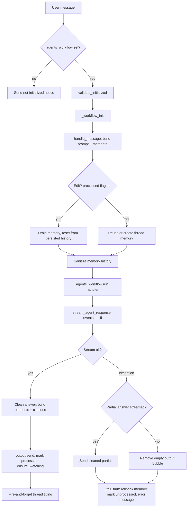

# Aria Message Pipeline

Detailed walkthrough of the message processing pipeline for the Aria web
UI: how an incoming user message becomes an agent run, how the response is
streamed, rendered, and persisted, and how every error path is cleaned up.

Source of truth:
[`src/aria/web/message_pipeline.py`](../src/aria/web/message_pipeline.py)
(entry point) and its supporting modules under
[`src/aria/web/`](../src/aria/web/).

## Table of Contents

- [Overview](#overview)
- [Entry Points](#entry-points)
- [End-to-End Flow](#end-to-end-flow)
- [Stage 1 — State Gate](#stage-1--state-gate)
- [Stage 2 — Workflow Init](#stage-2--workflow-init)
  - [Prompt Building](#prompt-building)
  - [Edit Detection](#edit-detection)
  - [Memory Lifecycle](#memory-lifecycle)
  - [History Sanitization](#history-sanitization)
- [Stage 3 — Workflow Run and Streaming](#stage-3--workflow-run-and-streaming)
- [Stage 4 — Rendering and Finalization](#stage-4--rendering-and-finalization)
- [Stage 5 — Post-Turn](#stage-5--post-turn)
- [Error Handling](#error-handling)
- [Message Metadata Contract](#message-metadata-contract)
- [Voice Pipeline Integration](#voice-pipeline-integration)
- [Session Lifecycle Context](#session-lifecycle-context)
- [Module Map](#module-map)

---

## Overview

The pipeline orchestrates one chat turn:

1. Validate app state is initialized.
2. Build the final prompt (enhancement, attachments, images, MCP,
   knowledge grounding).
3. Get or rebuild the thread's conversation memory.
4. Run the `AgentWorkflow` and stream events to the UI.
5. Render the answer (elements, citations, sources footer), persist it,
   and mark the user message as processed.
6. On any failure: roll back memory, mark the message as *not*
   processed, and tell the user.

Every step is delegated to a focused module; the pipeline itself only
sequences them and owns the bookkeeping.

---

## Entry Points

There are exactly two ways a message enters the pipeline:

| Entry | Wiring | Message shape |
|-------|--------|---------------|
| Typed chat message | `@cl.on_message` in [`web_ui.py`](../src/aria/web_ui.py) → `on_message_handler` | `cl.Message` as sent by the UI (may carry `command` = `Enhance`/`Knowledge`) |
| Voice turn | `process_audio()` in [`hooks.py`](../src/aria/web/hooks.py) calls `on_message_handler` directly | The echoed `cl.Message` (same object handed to the handler; `metadata={"voice": True}`) |

The handler returns the assistant `cl.Message` on success (the voice
pipeline reads its `answer_text` attribute for TTS) or `None` on error.

---

## End-to-End Flow



---

## Stage 1 — State Gate

Before anything else, the handler checks `_state.agents_workflow`
([`state.py`](../src/aria/web/state.py)). If the workflow was never built
(startup failed, LLM unavailable), the user gets a
*"system is not fully initialized"* notice and the turn ends — no memory
is touched, nothing is persisted.

`_state.validate_initialized()` then re-checks all required fields
(`llm`, `embeddings`, `vector_db`, `agents_workflow`, `db_engine`) plus
the `startup_complete` flag and raises `AppStateNotInitializedError` with
the missing-field list. This error is routed through the shared failure
path, not the early return, so the message is still marked unprocessed.

---

## Stage 2 — Workflow Init

`_workflow_init()` prepares memory and prompt. Returns
`(memory, prompt, pipeline_meta, is_edit)`.

### Prompt Building

[`prompt_builder.py`](../src/aria/web/prompt_builder.py)
(`handle_message`) composes the prompt in a fixed order. Each step
appends a block to the prompt text and contributes metadata:

1. **Prompt enhancement** — only when the message was sent with the
   `Enhance` command active. `_state.prompt_enhancer.run()` is awaited
   with a 30 s timeout and parsed into `PromptEnhancementResult`.
   Failure keeps the original prompt, sends an `ErrorMessage`, and the
   turn continues (enhancement is best-effort). Success sets
   `prompt_enhanced: True`.
2. **Voice mode** — if `metadata["voice"]` is set (voice pipeline only),
   `VOICE_MODE_INSTRUCTION` is prepended: keep the spoken answer short,
   persist long-form content to a file via `write_file`, no code blocks.
3. **Uploaded files** — `extract_file_paths()`
   ([`session.py`](../src/aria/web/session.py)) walks
   `message.elements`, skips images, copies each file into
   `<workspace>/uploads/<safe_thread>_<uuid>_<name>` (falling back to
   the original path if the copy fails), and the pipeline appends an
   `[Uploaded files]:` block listing the raw paths. Duplicates are
   removed order-preservingly. Disk I/O runs in `asyncio.to_thread` so
   a large upload cannot stall other sessions. Filenames land in
   `attachments` metadata.
4. **Images** — `extract_image_data()` reads image elements, resizes
   anything larger than 1024 px on either side (LANCZOS, prevents
   vLLM processor crashes), and base64-encodes it. With vision enabled,
   each image is described in parallel through `utility_completion`
   (thinking disabled, shared `httpx` client, 1024 max tokens) and an
   `[Attached images]:` block is appended. Per-image failure degrades to
   `<description unavailable>`. With vision disabled the whole block is
   omitted — no placeholder noise.
5. **MCP servers** — `append_mcp_block()` lists connected MCP servers
   and their tools (via `connected_tool_map()`) plus exact call syntax.
   Injected per turn because servers connect mid-session after the
   system prompt is fixed. No servers connected → prompt unchanged.
6. **Knowledge grounding** — only with the `Knowledge` command active
   and the knowledge hub enabled. `KnowledgeHubIndexer.query()` returns
   `top_k` chunks appended as `<knowledge source="...">` blocks wrapped
   in an untrusted-data warning. Sets `knowledge_grounded: True`.
   Retrieval failure keeps the prompt unchanged.

The returned metadata dict merges enhancement + attachment +
knowledge flags; it is persisted with the user message at the end of
the turn.

### Edit Detection

Chainlit re-delivers a message with the *same id* when the user edits it:
the `edit_message` socket handler mutates the existing message object in
`chat_context`, removes every later message of the turn, persists the
edited content, and re-invokes `on_message`. The pipeline distinguishes
**edit** from **retry** via the `processed` key on the *in-memory*
`message.metadata` — it does not re-read the database:

- `processed: true` on the delivered object → this delivery is an
  **edit** of an already-answered message.
- Key absent or false → the delivery is handled like a fresh turn
  (a failed turn wrote `processed: false`, making re-delivery a retry).

`_mark_message_processed()` writes the flag both to the data layer and
onto the in-memory `message.metadata`. A redelivered message therefore
carries `processed: true` through **either** path:

- **Resume** — `on_chat_resume` rebuilds Chainlit's `chat_context` from
  persisted steps, and `Message.from_dict()` includes their deserialized
  DB metadata.
- **Same-session edit** — Chainlit's `edit_message` handler mutates the
  *same* in-memory object in place and re-invokes `on_message`, so the
  flag written onto `message.metadata` travels with it.

Both now trigger the full edit reset below.

### Memory Lifecycle

Memory is a `BackgroundFlushMemory`
([`llm/memory.py`](../src/aria/llm/memory.py)) stored on
`cl.user_session` under `"memory"`, keyed to the thread id.

- **Reuse** — the existing instance is kept while
  `memory.session_id == message.thread_id`.
- **Replace** — otherwise (new chat, thread switch): the old instance is
  `drain()`ed first, then a fresh memory is created via
  `create_memory(thread_id)`. Creating memory requires
  `_state.vector_db` and `_state.embeddings` (asserted) and wraps
  `get_default_memory()` with the configured `token_limit`.
- **Edit reset** — on an edit, the old memory is drained and
  `_reset_memory_for_edit()` rebuilds it:
  1. Delete the thread's Chroma vector collection (best-effort;
     failure is logged at debug and ignored).
  2. Load the thread from the data layer; a missing thread raises
     `_EditThreadMissingError` — aborting rather than silently wiping
     the conversation's memory.
  3. `restore_chat_history()` rebuilds memory from the persisted thread
     steps (which Chainlit has already updated with the edited text).
- **Drain discipline** — `drain_memory()` must run every time a memory
  instance is dropped or replaced. `BackgroundFlushMemory` runs the
  embedding waterfall as a background task; without draining, in-flight
  turns are never embedded into Chroma and are lost once the trimmed
  in-context history no longer contains them. Drain never raises.

`restore_chat_history()` (also used by `on_chat_resume`) does:

1. Collect steps of type `user_message`/`assistant_message`
   (`ROOT_MESSAGE_TYPES`), sorted by `(createdAt, id)`. `get_thread()`
   returns *all* persisted steps — thinking/tool/run steps included —
   as one flat `createdAt`-ordered list; non-conversation types are
   filtered out here.
2. Convert to `ChatMessage`s (`user_message` → USER, else ASSISTANT;
    empty or error (`isError`) outputs skipped — a persisted
    `cl.ErrorMessage` must never enter restored memory).
3. Sanitize with `drop_trailing_user=False` (a resumed thread keeps its
   last user message in context).
4. Trim to the embedding queue budget:
   `token_limit × chat_history_token_ratio × 0.9` headroom — filling the
   budget exactly would make the next message re-cross the waterfall
   threshold and re-embed already-stored turns. `_trim_to_budget` walks
   newest-first, always starts the result on a user message, and
   force-keeps the newest user→assistant pair even over budget.
5. `memory.aset(trimmed)` replaces the chat store, then
    `memory.schedule_embed(dropped)` re-embeds the trimmed-off tail in
    the background — idempotent because each vector node is keyed by a
    SHA-256 hash of its own message text (`IdempotentVectorMemoryBlock`
    builds one node per message, so identical content hashes to the same
    ID regardless of how the batch is chunked).

### History Sanitization

Before every run, `_sanitize_memory()` normalizes the chat store via
`_sanitize_chat_history()` so the OpenAI/Mistral chat template
invariants hold (every assistant tool-call message must be followed by
exactly *N* `tool` results; plain turns must alternate user/assistant).
Four steps:

1. **Collapse consecutive duplicate roles** (keep last of each run) —
   never `tool` messages, never assistant messages carrying tool calls.
2. **Validate tool groups** — an assistant message advertising *N* tool
   calls is kept only if exactly *N* `tool` messages follow; dangling or
   partial groups are dropped entirely, as are orphan `tool` messages.
3. **Drop leading non-user messages** so history starts with `user`.
4. **Trim the trailing boundary** — drop a trailing assistant with
   unfulfilled tool calls; drop a trailing user message only when
   `drop_trailing_user=True` (pre-run, a new user message is about to
   be appended; resume passes `False`).

The read uses `memory.aget_all()` (raw store, no vector-block
injection) and the write `memory.aset()` (no waterfall). A
role+content fingerprint detects whether anything changed before
writing.

`_rollback_memory()` is the same repair, invoked on failures — it
removes the dangling user message / partial tool group a crashed turn
left behind.

---

## Stage 3 — Workflow Run and Streaming

`_stream_and_finalize()` starts the run:

```python
handler = _state.agents_workflow.run(
    user_msg=prompt,
    memory=memory,
    max_iterations=ChatConfig.max_iteration,   # MAX_ITERATIONS env
)
```

[`streaming.py`](../src/aria/web/streaming.py)
(`stream_agent_response`) consumes `handler.stream_events()` and maps
each LlamaIndex event to UI updates:

| Event | Handling |
|-------|----------|
| `AgentStream` (thinking delta) | Lazily creates a collapsed "Thinking" step and streams the delta into it; deltas accumulate in `thinking_parts`. |
| `AgentStream` (answer delta) | Finalizes any open thinking step, streams the delta into the output message; accumulates `answer_parts`. |
| `ToolCall` | Finalizes the thinking step, sends a persisted (collapsed) tool step labeled by the call's `reason` kwarg (fallback: tool name, ASCII-sanitized for avatar compatibility), `input` = tool kwargs. Tracked per `tool_id` in `pending_tool_steps` — results can arrive late or out of order. |
| `ToolCallResult` | Looks up the step by `tool_id` (id-less results settle the oldest pending step FIFO; unknown ids are dropped with a log), fills `output` (JSON objects render as formatted JSON), and updates the step. |
| `AgentOutput` | Finalizes thinking; if no content was streamed, streams the final response content — unless it is empty or merely repeats the thinking text. |

After the event loop, `await handler` yields the final result and
`_finalize_stream()`:

- flushes any open thinking step and pending tool steps,
- emits the final content if nothing was streamed yet,
- if *nothing at all* was emitted, streams a fallback
  ("I wasn't able to generate a response…") so the user never sees a
  silent bubble.

Returns `(emitted, meta, answer_text)` where `meta` is
`{"tools_called": [...], "has_thinking": bool}` and `answer_text` is the
clean answer (thinking excluded) — the voice pipeline's TTS input.

**Interruption contract:** if the stream raises after content was
emitted, `answer_text` is attached to the output message as the
`answer_text` attribute before re-raising, so the pipeline can persist
the partial answer instead of discarding the turn.

---

## Stage 4 — Rendering and Finalization

Back in `_stream_and_finalize()`'s `finally` block, the success path
(`stream_agent_response` returned normally) runs a fixed sequence. The
element-building and persistence steps are **best-effort**; marking the
message processed is **guaranteed** — a streamed-complete answer is a
successful turn even if element building or the final `send()` fails, so
it is never retried against memory that already holds the exchange.
This work lives in `_apply_render_elements()`:

1. **Clean the answer** — `strip_model_sources()` removes a trailing
   model-generated `**Sources:**` line (the model imitates the pipeline
   footer it sees in history; the real one is appended below, and a
   fake one would have no backing element).
2. **Extract renderables** — `extract_renderable_items()`
   ([`rendering.py`](../src/aria/web/rendering.py)) scans the answer
   for:
   - markdown links `[text](target)` — link text becomes the element
     name,
   - backtick-wrapped or standalone-line paths (known extensions only;
     bare paths in prose are ignored to avoid false positives) — kept
     only if the file exists on disk,
   - bare `http(s)` URLs anywhere *outside fenced code blocks*
     (trailing punctuation/emphasis wrappers trimmed; unbalanced
     parentheses preserved for Wikipedia-style URLs) — all citation
     candidates.
3. **Build elements** — `create_render_elements()` (best-effort: a
   failure is logged and leaves no elements, so the plain answer still
   ships):
   - local images → `cl.Image` inline; PDFs → `cl.Pdf` side; text/code →
     `cl.Text` side with a language hint; anything else → `cl.File` side,
   - remote image URLs → inline `cl.Image` (`` needs no CORS),
   - other URLs → [`citations.py`](../src/aria/web/citations.py)
     fetches them **server-side** (capped at 5) and attaches
     content-backed elements. Rationale: the data layer stores external
     `url=` verbatim, so the browser would fetch them and CORS blocks
     most hosts. Fetching enforces an SSRF guard (public http(s) hosts
     only, every redirect hop re-validated), a 10 s per-citation
     deadline, a 5 MB body cap, and converts HTML → markdown from the
     `<article>`/`<main>` substance. Any failure silently drops that
     citation — the markdown link stays clickable.
4. **Footer** — when citations exist, `output.content` becomes
   `clean_answer + sources_footer(names)` (a `**Sources:**` chip line);
   `output.answer_text` stays clean for TTS. When there are no
   citations but cleaning changed the text, content is overridden with
   the clean answer. Elements are attached when non-empty.
5. **Ship it** — `await output.send()` persists the assistant message
    (best-effort: a persistence failure is logged, never fatal).
6. **Mark processed** — `_mark_message_processed()` rewrites the user
    message's step in the data layer with the full metadata schema:
    defaults + `pipeline_meta` (enhancement/attachments/knowledge) +
    `stream_meta` (tools_called/has_thinking) + `processed: true`.
    The write is an upsert (`create_step` → `ON CONFLICT (id) DO
    UPDATE`), so retries and edits keep exactly one row per user message.
    Runs **unconditionally** even if element building or send() failed;
    failure to persist is logged, never fatal.
7. **Supervision** — `ensure_watching(thread_id, for_id=output.id)`
    ([`supervisor.py`](../src/aria/web/supervisor.py)) arms a watcher
    task per supervised worker found in the thread so their tasklists
    keep updating (see `docs/worker-tasklist-supervision.md`). Best-effort:
    a watcher failure is logged and never unprocesses a completed turn.

The **failure path** inside `finally` (stream raised):

- partial answer streamed (`output.answer_text` set): clean it, build
  elements/footer the same way, and send — the user keeps what was
  generated. The turn is then still routed to `_fail_turn` (the
  exception propagates), which marks the user message unprocessed so a
  retry re-runs it.
- nothing streamed but the bubble exists (`output.streaming`): the
  empty output message is removed.

`stream_meta` is still returned either way.

---

## Stage 5 — Post-Turn

On success, `on_message_handler` calls `_maybe_rename_thread()`:

- Runs **once per session** (per-session `thread_titled` flag set to
  `False` by `on_chat_start`, `True` by `on_chat_resume`) — so resumed
  conversations are never re-titled.
- Fire-and-forget `asyncio.create_task(maybe_title_thread(...))`
   ([`thread_titler.py`](../src/aria/web/thread_titler.py)): a
   `utility_completion` call (max 6 words, 50 tokens, 15 s timeout)
   generates a title from the first user/assistant exchange — the
   assistant reply is the clean `answer_text` (the `**Sources:**` footer
   lives only in `output.content` and is not passed on) — persists it
   via `data_layer.update_thread()`, and pushes a `first_interaction`
   socket event so the sidebar updates live. Any failure keeps the
   Chainlit-default name (first message verbatim).

The handler returns the assistant `cl.Message` (voice pipeline reads
`answer_text` for TTS).

---

## Error Handling

Every error path funnels into `_fail_turn()` so the bookkeeping cannot
drift between branches. Given `(message, memory, pipeline_meta, error,
user_message, log_level)`:

1. Log at the given level (`error` by default, `exception` for unknown
   errors — full traceback).
2. `_rollback_memory(memory)` — repair the dangling user message or
   partial tool group the failed turn left in the chat store.
3. `_mark_message_processed(..., processed=False)` — persist
   `error: str(error)` plus the pipeline metadata with `processed`
   false, so re-delivery of the same message is a **retry**, not an
   edit.
4. Send the user-facing explanation as a `cl.ErrorMessage` — it renders
   as an error bubble in the UI and is excluded from restored memory
   (see [Memory Lifecycle](#memory-lifecycle)).

Routing table:

| Exception | User message |
|-----------|--------------|
| `AppStateNotInitializedError` | "The application is not fully initialized. Please wait a moment and try again." |
| `_EditThreadMissingError` | "This conversation could not be found, so the edit could not be applied. The thread may have been deleted." |
| `httpx.TimeoutException` | "The model took too long to respond. Please try again." |
| anything else (`exception` level) | context-overflow message when `str(e)` contains "maximum context length", else "An error occurred. Please try again." |

---

## Message Metadata Contract

`_DEFAULT_METADATA` defines the stable schema downstream consumers
(voice pipeline, edit detection, UI) rely on. All keys are always
present; extras override defaults. Keys Chainlit or the client put on
the message (e.g. `location`) survive: the merge order is
`message.metadata` → `_DEFAULT_METADATA` → `extra_metadata` →
`processed`, so only the known keys are overridden.

| Key | Type | Meaning |
|-----|------|---------|
| `tools_called` | `list[str]` | Tool names invoked during the turn (from streaming). |
| `has_thinking` | `bool` | Any reasoning/thinking delta was streamed. |
| `processed` | `bool` | `True` after a successful turn → a re-delivery is an **edit**. `False` after a failure → a re-delivery is a **retry**. Reaches a redelivered message object only via resume (see [Edit Detection](#edit-detection)). |
| `prompt_enhanced` | `bool` | The `Enhance` command ran successfully. |
| `attachments` | `list[str]` | Filenames of non-image uploads. |
| `error` | `str` | Empty on success; the exception text on failure. |
| `knowledge_grounded` | `bool` *(extra)* | Knowledge-hub retrieval ran. |

`_mark_message_processed()` writes this dict both onto the user message's
step (`data_layer.create_step(message.to_dict())`) and onto the
in-memory `message.metadata`, so a same-session edit re-delivered by
Chainlit carries the flag too. Persistence failures are logged and
swallowed — the turn's outcome is unaffected.

---

## Voice Pipeline Integration

Voice turns reuse this pipeline unchanged
([`hooks.py`](../src/aria/web/hooks.py)):

1. Mic chunks accumulate; an RMS-silence timeout (or stream end) fires
   `process_audio()` under a `voice_processing` guard.
2. PCM → WAV → whisper.cpp STT (non-speech tags stripped; empty
   transcription aborts). The transcription is echoed to the UI as a
   user message.
3. The echoed `cl.Message` is sent to the UI and then passed to
   `on_message_handler` **as the same object**, so a single
   `user_message` step is persisted for the turn. The `voice` key
   triggers `VOICE_MODE_INSTRUCTION` in prompt building.
4. On success the handler's returned message carries `answer_text`
   (clean, thinking-free). It is reduced to plain text
   (`_strip_markdown_for_tts` — fenced code first, then inline code,
   images, links, URLs, paths, structure, emphasis), synthesized by
   Kokoro, and attached to the already-sent assistant message as an
   auto-playing `cl.Audio` element via `output.update()`.

---

## Session Lifecycle Context

The pipeline depends on state established by the lifecycle handlers
([`hooks.py`](../src/aria/web/hooks.py)):

| Handler | Pipeline-relevant work |
|---------|------------------------|
| `on_chat_start` | Drains stale memory, clears it, sets `thread_titled = False`, registers the `Knowledge` and `Enhance` commands. |
| `on_chat_resume` | Sets `thread_titled = True` (never re-title resumed threads), waits up to 30 s for app initialization, sets the session thread id to the resumed thread so every message lands in it, restores memory via `restore_chat_history()`, re-arms supervision watchers. |
| `on_chat_end` | Cancels all supervision watchers, drains and clears memory. |
| `on_mcp_connect/disconnect` | Maintains the `_mcp_sessions` map backing the per-turn MCP prompt block. |

---

## Module Map

| Module | Responsibility in the pipeline |
|--------|-------------------------------|
| [`web_ui.py`](../src/aria/web_ui.py) | Thin Chainlit decorators; forwards to handlers. |
| [`web/message_pipeline.py`](../src/aria/web/message_pipeline.py) | Orchestration: state gate, init, run, finalize, error paths, metadata persistence, titling. |
| [`web/prompt_builder.py`](../src/aria/web/prompt_builder.py) | Prompt composition: enhance, voice, files, images, MCP, knowledge. |
| [`web/session.py`](../src/aria/web/session.py) | Memory creation/drain, upload/image extraction, history sanitization, rollback, edit reset, resume restore. |
| [`web/streaming.py`](../src/aria/web/streaming.py) | Agent events → Chainlit steps/messages; answer_text contract. |
| [`web/rendering.py`](../src/aria/web/rendering.py) | Answer text → elements (local files) + citation refs; sources footer. |
| [`web/citations.py`](../src/aria/web/citations.py) | Server-side citation fetch (SSRF-guarded) → content-backed elements. |
| [`web/thread_titler.py`](../src/aria/web/thread_titler.py) | First-turn LLM thread title + live sidebar update. |
| [`web/state.py`](../src/aria/web/state.py) | `AppState` singleton; initialization validation. |
| [`web/hooks.py`](../src/aria/web/hooks.py) | Lifecycle handlers, data-layer cache, voice pipeline. |
| [`web/supervisor.py`](../src/aria/web/supervisor.py) | `ensure_watching` — arm worker tasklist watchers after a turn. |
| [`llm/memory.py`](../src/aria/llm/memory.py) | `BackgroundFlushMemory` (off-critical-path embedding waterfall), idempotent per-message vector nodes, `drain`/`schedule_embed`. |
