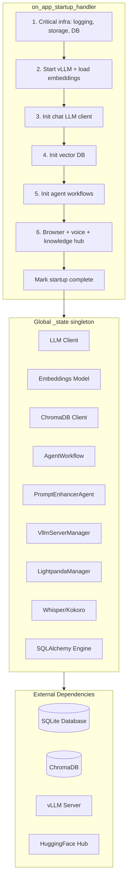
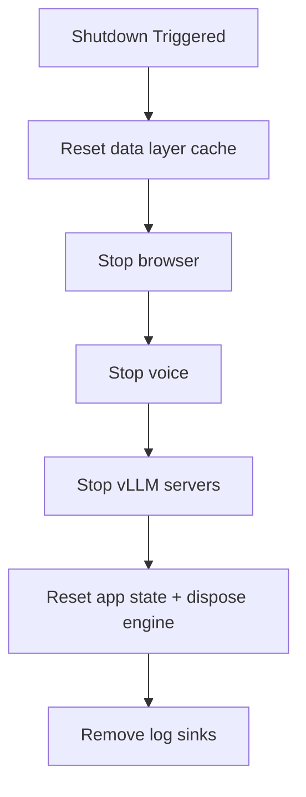

# Aria Web UI Initialization Process

Detailed explanation of the initialization process for the Aria web UI:
prerequisites, startup sequence, state lifecycle, failure handling, and
shutdown.

## Table of Contents

- [Overview](#overview)
- [Architecture](#architecture)
- [Prerequisites](#prerequisites)
- [Startup Sequence](#startup-sequence)
- [AppState Lifecycle](#appstate-lifecycle)
- [Points of Failure](#points-of-failure)
- [Shutdown Process](#shutdown-process)
- [Troubleshooting](#troubleshooting)

---

## Overview

The web UI is built on [Chainlit](https://chainlit.io/). Startup is
orchestrated by [`on_app_startup_handler()`](../src/aria/web/lifecycle.py),
invoked from the thin [`on_app_startup`](../src/aria/web_ui.py) entry point
that Chainlit's `@cl.on_app_startup` decorator registers.

Shared services and resources live in a global singleton: the
[`AppState`](../src/aria/web/state.py) Pydantic model (`_state`). The
matching teardown is [`on_app_shutdown_handler()`](../src/aria/web/lifecycle.py).

---

## Architecture



---

## Prerequisites

### Environment Variables

Required and optional variables (see `src/aria/config/` for the authoritative
definitions):

| Variable | Required | Description | Example |
|----------|----------|-------------|---------|
| `DATA_FOLDER` | Yes | Base data directory path | `data` |
| `ARIA_DB_FILENAME` | Yes | SQLite database filename | `aria.db` |
| `LOCAL_STORAGE_PATH` | Yes | Local storage subdirectory | `storage` |
| `CHROMADB_PERSISTENT_PATH` | Yes | ChromaDB persistence directory | `chromadb` |
| `CHAT_OPENAI_API` | Yes | Chat LLM API endpoint | `http://localhost:9090/v1` |
| `CHAT_MODEL` | Yes | Chat model name | `Granite-4.1-8B` |
| `CHAT_MODEL_PATH` | Yes | HuggingFace model path | `ethanhunt3/Granite-4.1-8B-GPTQ-INT4` |
| `CHAT_CONTEXT_SIZE` | Yes | Chat context window size | `32768` |
| `MAX_ITERATIONS` | Yes | Max agent iterations | `50` |
| `TOKEN_LIMIT_RATIO` | Yes | Memory token limit ratio | `0.80` |
| `EMBEDDINGS_MODEL` | Yes | Embeddings model name | `granite-embedding-311m-multilingual-r2` |
| `EMBED_MODEL_PATH` | Yes | HuggingFace embeddings path | `ibm-granite/granite-embedding-311m-multilingual-r2` |
| `EMBEDDINGS_CONTEXT_SIZE` | Yes | Embeddings context size | `8192` |
| `CHAINLIT_AUTH_SECRET` | Yes | Secret for Chainlit auth | `your-secret-here` |
| `ARIA_VLLM_QUANT` | No | vLLM quantization method | `gptq_marlin` |
| `ARIA_VLLM_GPU_MEMORY_UTILIZATION` | No | GPU memory utilization (auto if unset) | `0.85` |
| `ARIA_VLLM_KV_CACHE_DTYPE` | No | KV cache data type | `fp8` |
| `ARIA_VLLM_TP_SIZE` | No | Tensor parallel size | `1` |
| `ARIA_VLLM_API_KEY` | No | vLLM API key | `sk-aria` |
| `ARIA_VLLM_TOOL_CALL_PARSER` | No | Tool call parser for model family | `granite4` |
| `HUGGINGFACE_TOKEN` | No | HF token for gated models | `` |

### Directory Structure

Expected under `DATA_FOLDER`:

```
data/
├── aria.db              # SQLite database (created if not exists)
├── chromadb/            # ChromaDB persistence (created automatically)
├── storage/             # Local file storage for uploads
├── logs/
│   ├── debug.log        # Application logs
│   ├── tools.log        # Tool-call debug logs
│   └── startup-error.txt # Written on fatal startup abort
├── bin/
│   └── lightpanda/      # Lightpanda headless browser binary
└── models/              # Downloaded model files (optional, vLLM uses HF cache)
```

### External Services

vLLM serves the chat model; embeddings load in-process via HuggingFace.

| Service | Default Port | Purpose |
|---------|--------------|---------|
| vLLM server(s) | configured per model | Chat LLM inference |
| Embeddings | In-process | Text embeddings (loaded via HuggingFace) |

### First-boot bootstrap (`aria init`)

All initialization lives in the `aria init` command (and the GUI setup
wizard, which is the GUI's init path). It runs once before `aria server
start` and is idempotent — re-runs skip already-installed pieces and
never overwrite user-set `.env` values. The flow:

1. Bootstrap ARIA_HOME (`.env`, dirs, DB, assets, chainlit config).
2. Detect hardware (NVIDIA-only this iteration; ROCm/Metal/CPU → remote).
3. Choose chat mode (local vLLM with a GPU, or a remote OpenAI-compatible
   endpoint). No GPU + no remote configured → abort (no CPU-vLLM mode).
4. Apply the feature matrix to `.env` + `.chainlit/config.toml` (vision
   image-upload MIME types, docling device, voice).
5. Install binaries (Lightpanda always; vLLM local-chat only; docling
   always; voice when enabled and a GPU is present).
6. Download models (chat local-chat only; embeddings + docling always;
   whisper/kokoro when voice is enabled).
7. Warn on small GPUs (< 12 GB VRAM) when voice or docling CUDA is enabled.
8. Verify via preflight; hard failures exit 1 (hardware-fit findings are
   advisories only — `aria config optimize` and vLLM's runtime context
   clamp resolve them).
9. Print a summary, then write `$ARIA_HOME/.init-completed.json` on
   success only — a failed init never passes the entry-point gate.

The `aria`, `ax`, and `aria-gui` entry points gate on that marker: non-init
commands refuse to run until it exists (the GUI routes into the wizard
instead of refusing). Existing installs have no marker — the first run
after upgrade fires the gate and `aria init` completes in seconds (every
step is a no-op for an already-provisioned ARIA_HOME) and writes it.

---

## Startup Sequence

`on_app_startup_handler()` runs three phases. Critical-infra failures are
fatal (trigger full rollback); later subsystems are best-effort.

### Phase 1 — Critical Infrastructure

`_init_critical_infra()`:

1. **Langfuse** (`_init_langfuse()`) — optional instrumentation if all
   `LANGFUSE_*` env vars are present; otherwise skipped with a warning.
2. **Logging** (`_init_logging()`) — loguru file sinks:
   - Main sink → `logs/debug.log`, rotation 10 MB, level `INFO`
   - Tool-call sink → `logs/tools.log`, level `DEBUG`, filtered by the
     `tool_call` extra set by `log_tool_call`
   - uvicorn access logs filtered to suppress health-check noise
3. **Storage mount** (`_init_storage_mount()`) — inserts a `/storage/{file_path}`
   route at the head of Chainlit's router to serve uploaded files before
   the SPA catch-all.
4. **Database** (`_init_database()`) — `create_engine(SQLiteConfig.db_url)`
   and `Base.metadata.create_all(...)`.
5. **Storage sweep** (`_sweep_orphaned_storage()`) — reclaims element files
   on disk with no matching DB row; runs off-thread, never fatal.

### Phase 2 — vLLM + Embeddings

Embeddings loading starts **concurrently** with vLLM startup:

- `embed_task = asyncio.create_task(asyncio.to_thread(_load_embeddings_sync))`
- `_load_embeddings_sync()` fails fast if the embeddings model is not
  pre-downloaded locally — it never triggers a HuggingFace download at
  startup.
- If `ARIA_VLLM_REMOTE=true`, the remote endpoint is probed via
  `_probe_remote_vllm()` and local servers are **not** started.
- Otherwise `_init_vllm_servers()`:
  - Creates a `VllmServerManager`.
  - If the chat vLLM is already healthy on its port (probed with retries
    to tolerate transient GPU-load timeouts), it **adopts** the existing
    process and skips `start_all()` — preventing a destructive restart.
  - Otherwise calls `start_all()` to launch all configured servers.

### Phase 3 — Remaining Subsystems

1. **Embeddings finalize** (`_finalize_subsystems`) — awaits `embed_task`.
   Failure here is fatal.
2. **Chat LLM client** (`_safe_init_chat_llm`) → `get_chat_llm(...)`.
   Best-effort: a failure logs a warning and the LLM stays `None`.
3. **Vector DB** (`_safe_init_vector_db`) → `_init_vector_db()`:
   - Validates the ChromaDB path is writable.
   - On `ChromaError` (corruption) it resets the directory and retries.
   - Other errors are **not** wiped (avoids nuking threads' embeddings).
4. **Orphaned-collection cleanup** (`_cleanup_orphaned_collections`) —
   removes ChromaDB collections for threads no longer in SQLite.
5. **Agent workflows** (`_safe_init_agent_workflows`) — `get_agent_workflow`
   and `get_prompt_enhancer_agent` (only if the LLM initialized).
6. **Browser** (`_safe_init_browser`) — starts Lightpanda if available.
7. **Voice** (`_safe_init_voice`) — starts whisper.cpp STT and kokoro TTS.
8. **Knowledge hub** — if `KnowledgeHub.enabled`, creates the tools DB
   tables and fires off a background reindex task.

Finally:

- `_state.startup_complete = True`
- `_state.startup_event.set()`
- `DebugConfig.startup_error_path` is unlinked.

---

## AppState Lifecycle

### State Structure

`AppState` is a Pydantic `BaseModel` in `src/aria/web/state.py`:

```python
class AppState(BaseModel):
    model_config = {"arbitrary_types": True}

    llm: OpenAILike | None = None
    embeddings: BaseEmbedding | None = None
    vector_db: ClientAPI | None = None
    agents_workflow: AgentWorkflow | None = None
    prompt_enhancer: PromptEnhancerAgent | None = None
    vllm_manager: VllmServerManager | None = None
    browser_manager: Any = None
    voice_manager: Any = None
    db_engine: Engine | None = None
    startup_complete: bool = False
    startup_event: asyncio.Event = asyncio.Event()
```

Required fields (`_REQUIRED_FIELDS`): `llm`, `embeddings`, `vector_db`,
`agents_workflow`, `db_engine`.

### Validation

- `is_initialized()` — `True` when all required fields are non-`None` **and**
  `startup_complete` is `True`.
- `validate_initialized()` — raises `AppStateNotInitializedError` listing
  the missing fields otherwise.

```python
_state.validate_initialized()  # raises if not ready
handler = _state.agents_workflow.run(...)
```

### Low-ratio warning

`_warn_low_history_ratio()` logs a warning when
`CHAT_HISTORY_TOKEN_RATIO` is set below `0.30`, since that drives
per-turn embedding flushes on the UI critical path.

---

## Points of Failure

### Critical Failures (app will not start)

| Phase | Failure | Symptom | Resolution |
|-------|---------|---------|------------|
| Logging | Permission denied | Silent failure/crash | Check directory permissions |
| Database | Cannot create file | Exception at startup | Verify `DATA_FOLDER` exists and is writable |
| vLLM (local) | Not installed | startup failure | Run `aria init` (or `aria vllm install`) |
| vLLM (local) | Missing model | Model load failure | Run `aria init` (or `aria models download --model chat`) |
| vLLM (local) | Port in use | Health-check timeout | Kill the process on the port |
| vLLM (local) | GPU OOM | Server crash | Reduce `CHAT_CONTEXT_SIZE` or use a smaller model |
| vLLM (remote) | Endpoint unreachable | startup abort | Check `CHAT_OPENAI_API` and network |
| Embeddings | Not pre-downloaded | startup abort | Run `aria init` (or `aria models download --model embeddings`) |
| LLM | Connection refused | LLM stays `None` | Ensure vLLM is healthy |

A failure in critical infra or vLLM/embeddings triggers `_abort_startup`:
writes a `startup_error_path` marker, logs the exception, calls
`_cleanup_on_failure()` (reverse-order teardown), then `SystemExit(1)`.

### Non-Critical Failures (degraded functionality)

| Component | Failure | Impact | Fallback |
|-----------|---------|--------|----------|
| `prompt_enhancer` | Not initialized | Enhance command unavailable | Original prompt used |
| `browser_manager` | Lightpanda missing/failed | Browser tools disabled | Other tools work |
| `voice_manager` | whisper/kokoro failed | Voice features disabled | Text-only mode |
| `vector_db` | Init failed | Vector memory unavailable | Logged, app continues |

### Runtime Failures

| Scenario | Error | Handling |
|----------|-------|----------|
| AppState not initialized | `AppStateNotInitializedError` | Caller shows a "please wait" message |
| Message processing error | `Exception` | User sees an error notice |
| Chat history restore failure | `Exception` | Logged, chat continues with empty memory |

---

## Shutdown Process

`on_app_shutdown_handler()` performs graceful, **order-sensitive** teardown.
Fast child servers (browser, voice) stop *before* vLLM — vLLM unload is slow
and can exhaust the external `stop` timeout, getting the process SIGKILLed
mid-shutdown; anything not yet stopped would leak as an orphan.

1. `reset_data_layer_cache()` (from `aria.web.hooks`)
2. `_stop_browser()` — Lightpanda; clears `browser_manager`.
3. `_stop_voice()` — kokoro TTS then whisper.cpp STT; clears
   `voice_manager`.
4. `_stop_vllm_servers(...)` — `vllm_manager.stop_all()`, honoring a
   `skip_vllm_shutdown` sentinel (left running if present).
5. `_reset_app_state()` — nulls all state fields, disposes the engine,
   clears `startup_event`.
6. `_remove_log_sinks()` — removes the two loguru sinks last so cleanup
   logging is still captured.



---

## Troubleshooting

### 1. AppStateNotInitializedError

Users see "not fully initialized". Causes: startup failed (check the
`startup_error_path` marker), or a request arrived before startup finished.

```bash
# Look for the startup error marker and logs
ls data/logs/  # startup-error.txt on fatal abort
grep -i "failed\|error" data/logs/debug.log
```

### 2. vLLM Server Timeout

"Starting vLLM inference servers…" hangs. Causes: missing/invalid model,
insufficient GPU memory, port in use.

```bash
lsof -i :9090     # port conflict
nvidia-smi        # GPU memory
aria vllm status   # installation
aria init          # install + download everything (idempotent)
```

### 3. Database Errors

Authentication fails or history doesn't persist.

```bash
ls -la data/aria.db
sqlite3 data/aria.db "PRAGMA integrity_check;"
```

### 4. ChromaDB Errors

Memory/context not working. Causes: corrupted vector store, permissions.

```bash
ls -la data/chromadb/
```

Resolution: back up and delete the ChromaDB directory, then restart to
recreate it.

### 5. Embeddings Not Found

Startup aborts with "Embeddings model not found locally". The embeddings
model must be pre-downloaded; no auto-download happens at startup.

```bash
aria init  # or: aria models download --model embeddings
```

### Health Check Endpoints

| Service | Endpoint | Expected |
|---------|----------|----------|
| vLLM server | `http://localhost:<port>/health` | `200` |

---

## Related Files

- [`src/aria/web_ui.py`](../src/aria/web_ui.py) — Chainlit entry point (thin)
- [`src/aria/web/lifecycle.py`](../src/aria/web/lifecycle.py) — startup/shutdown handlers
- [`src/aria/web/state.py`](../src/aria/web/state.py) — `AppState` singleton
- [`src/aria/config/api.py`](../src/aria/config/api.py) — vLLM/service config
- [`src/aria/config/database.py`](../src/aria/config/database.py) — DB config
- [`src/aria/config/models.py`](../src/aria/config/models.py) — model config
- [`src/aria/config/folders.py`](../src/aria/config/folders.py) — data/log folder config
- [`src/aria/server/vllm.py`](../src/aria/server/vllm.py) — vLLM server manager
- [`src/aria/llm/`](../src/aria/llm/) — LLM, embeddings, and agent-workflow factory
- [`src/aria/db/models.py`](../src/aria/db/models.py) — database models
